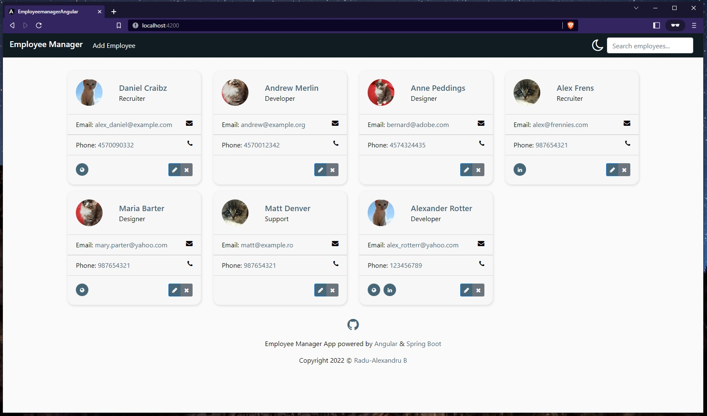
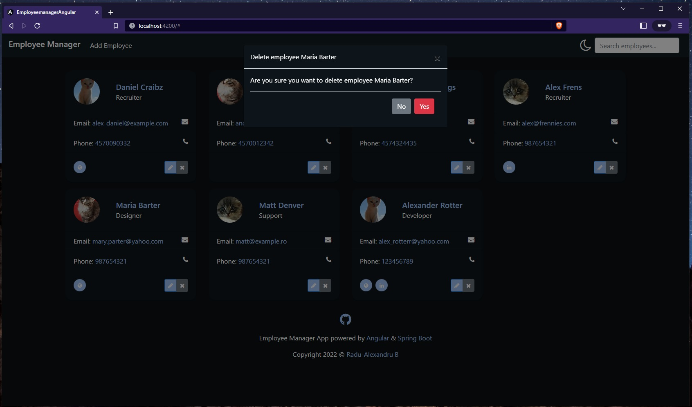
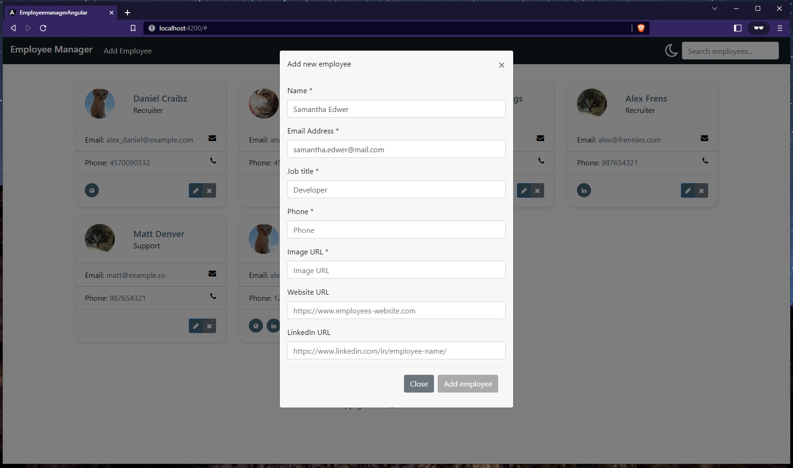
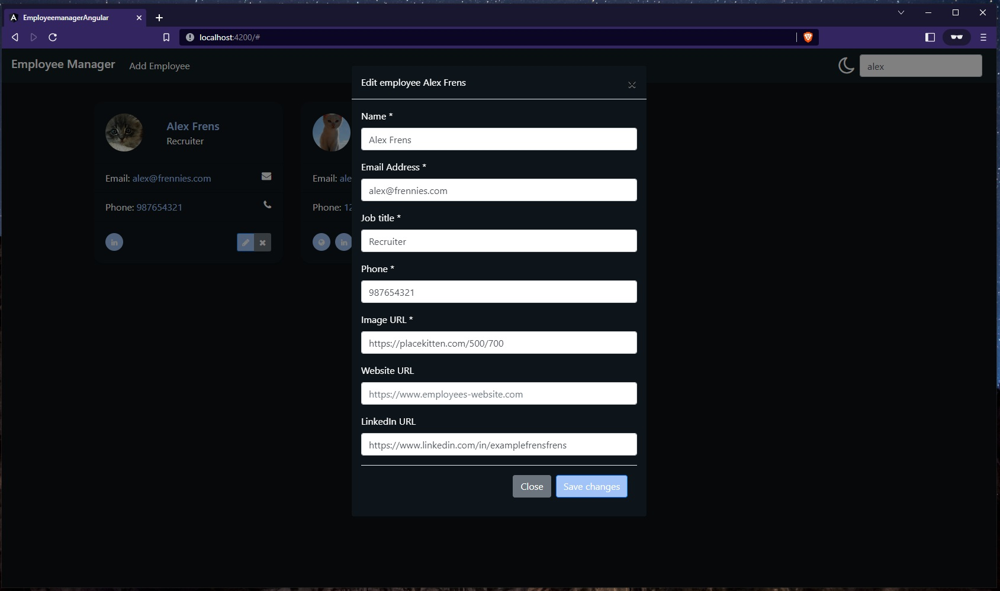

# Employee Manager App with Angular and SpringBoot Rest API

Employee Manager App that permits CRUD operations through Angular SPA that consumes a SpringBoot REST API connected to MySQL Database.

This project is based on [Spring Boot Full Stack with Angular App - Full Course 05-Feb-2021 - Amigoscode - 2h40m](https://youtu.be/Gx4iBLKLVHk) tutorial. The complete documentation for this project can be found here: [Spring Boot Full Stack with Angular Application - Full Course 05-Feb-2021 - Amigoscode](https://github.com/radualexandrub/Study/blob/master/SpringBoot/SpringBootWithAngularCourse.md).

<br/>

Contents:

- [Employee Manager App with Angular and SpringBoot Rest API](#employee-manager-app-with-angular-and-springboot-rest-api)
  - [Screenshots](#screenshots)
  - [SpringBoot REST API URLs](#springboot-rest-api-urls)
  - [Install Dependencies](#install-dependencies)
    - [Clone this repository](#clone-this-repository)
    - [Configure MySQL](#configure-mysql)
    - [Install and Configure Java and Maven](#install-and-configure-java-and-maven)
    - [Install Node.js, npm and Angular](#install-nodejs-npm-and-angular)
  - [Running the app locally](#running-the-app-locally)
  - [Running locally with Docker 🚀](#running-locally-with-docker-)
  - [Folder Project Structure](#folder-project-structure)
  - [License](#license)

<br/>

## Screenshots









<br/>

## SpringBoot REST API URLs

- `http://localhost:8080/api/employees` - GET - `getAllEmployees()`

- `http://localhost:8080/api/employees/{id}` - GET - `getEmployeeById(@PathVariable("id") Long id)`

- `http://localhost:8080/api/employees/new` - POST - `addEmployee(@RequestBody Employee employee)`

- `http://localhost:8080/api/employees/update` - PUT - `updateEmployee(@RequestBody Employee employee)`

- `http://localhost:8080/api/employees/{id}` - DELETE - `deleteEmployee(@PathVariable("id") Long id)`

<br/>

## Install Dependencies

### Clone this repository

```bash
git clone https://github.com/radualexandrub/SpringBoot-Angular-EmployeeManagerApp SpringBoot_EmployeeManagerApp
```

### Configure MySQL

- First, start the MySQL Service:

  - In Windows, open the Start Menu, search and open "Services", manually find MySQL80 service -> Right click it -> Start
  - In Debian, run `sudo systemctl start mysql.service`

- Set up the root (or user) password for MySQL:

  - In Windows, you can set the root password during the MySQL installation process
  - In Debian, right after installing MySQL (`sudo apt install mysql-server`), you can run `sudo mysql_secure_installation` to run the MySQL Installation script (you can follow along [this tutorial from DigitalOcean](https://www.digitalocean.com/community/tutorials/how-to-install-mysql-on-ubuntu-20-04))

- In SpringBoot app, go to `src/main/resources/application.properties` and set the `spring.datasource.password` to match the password set for MySQL

- Finally, create the `employeemanager` database:

  - You can create this database by opening MySQL Workbench GUI, log in, and run `create database employeemanager;` (or you can run this command from MySQL CLI in Windows)
  - In Debian, run `sudo su`, then `sudo mysql -u root -p` to login and access the MySQL CLI, then run `create database employeemanager;`

- Check the database with the following commands:
  - `show databases;`
  - `use employeemanager;`
  - `show tables;` (it should be empty if SpringBoot app was never ran)
  - `select * from employee;` (it should return error SpringBoot app was never ran)

### Install and Configure Java and Maven

- For x64 Windows:

  - (Recommended) You can download the JDK (Java Development Toolkit) separately from here: https://www.oracle.com/java/technologies/downloads/#jdk17-windows
  - Go to "System Properties" (Can be found on Control Panel > System and Security > System > Advanced System Settings)
  - Click on the "Environment variables" button under the "Advanced" tab
  - Then, select the "Path" variable in System variables and click on the "Edit" button
  - Click on the "New" button and add the path where Java is installed, followed by \bin. By default, Java is installed in `C:\Program Files\Java\jdk-11.0.1` (If nothing else was specified when you installed it). In that case, You will have to add a new path with: `C:\ProgramFiles\Java\jdk-11.0.1\bin` Then, click "OK", and save the settings
  - Restart PC
  - Open Command Prompt (cmd.exe) and type `java -version` to see if Java is running on your machine
  - Then, you can download and install Maven from here: https://maven.apache.org/download.cgi

- For x64 Debian based systems (Ubuntu, Linux Mint, Zorin OS, KDE Neon, etc):

  - Run the following commands based on [this tutorial](https://www.digitalocean.com/community/tutorials/how-to-install-java-with-apt-on-ubuntu-18-04)
    - `sudo apt install default-jre`
    - `sudo apt install default-jdk`
    - `java -version`
    - `javac -version`
    - `sudo update-alternatives --config java`
    - `sudo update-alternatives --config javac`
  - Set the `$JAVA_HOME` Environment Variable
    - `sudo nano /etc/environment`
    - write `JAVA_HOME="/usr/lib/jvm/java-11-openjdk-amd64"`
    - `cat /etc/environment`
  - Install Maven: `sudo apt install maven`
    - `mvn -v`

### Install Node.js, npm and Angular

- For x64 Windows:

  - First, download [Node.js](https://nodejs.org/en/download/) - we need it to use NPM (Node Package Manager)
  - Make sure you have `C:\Program Files\nodejs\` path on your `System Properties > Environment Variables > System Variables > Path`. Restart PC.
  - Then install the Angular CLI: To install the Angular CLI globally, open a terminal window and run the following command (You will run this only once): `npm install -g @angular/cli`
  - Within `employeemanager-angular` Angular App folder, run `npm install`

- For x64 Debian based systems (Ubuntu, Linux Mint, Zorin OS, KDE Neon, etc):

  - Run `curl -s https://deb.nodesource.com/setup_16.x | sudo bash` (to get Node v16)
  - Run `sudo apt install nodejs -y`
  - Install npm `sudo npm install -g npm@8.19.2`
  - Install Angular `sudo npm install -g @angular/cli`
  - Within `employeemanager-angular` Angular App folder, run `npm install`

<br/>

## Running the app locally

The complete project (MySQL + SpringBoot BackEnd + Angular FrontEnd) can be started with these steps:

- start the MySQL Server by opening Windows Start Menu, search and open "Services", manually find MySQL80 service -> Right click it -> Start (for Linux, run `sudo systemctl start mysql.service`)
- start the SpringBoot Back-end Server with **`mvn spring-boot:run`** and test on http://localhost:8080/api/employees
- start the Front-end Angular Application with **`ng serve --open`** and open http://localhost:4200/

<br/>

## Running locally with Docker 🚀

If you cannot install MySQL, Java, Maven and Node.js/Angular on your machine, you can run this Application with [Docker](https://www.docker.com/products/docker-desktop/).

🔵 Note: The containers will run this App for a Production environment:

- Front-End (configured in `Angular.Dockerfile`) will run the static build with Nginx
- Back-End (configured in `Spring.Dockerfile`) will run the application's built package
- MySQL8 (configured in `docker-compose.yml`)

<br/>

Steps:

- Clone this repo

```bash
git clone https://github.com/radualexandrub/SpringBoot-Angular-EmployeeManagerApp employeemanager
cd employeemanager
```

- Build (and run as containers) the database, front-end and back-end images via `docker-compose.yml` file with [`docker compose up`](https://docs.docker.com/engine/reference/commandline/compose_up/) command

```bash
docker compose up

# or -d to supress logs (Detached mode: Run containers in the background)
docker compose up -d
```

- Open the front-end app (on http://localhost:8081/) and the back-end Spring API (on http://localhost:8080/)

- Play with the app (you can follow the app's logs with [`docker-compose logs -f`](https://docs.docker.com/engine/reference/commandline/compose_logs/))

- Stop all Docker containers

```bash
docker-compose down

# or use -v to also remove the volumes used for MySQL, also remove other remaining containers
docker-compose down -v --remove-orphans
```

- Remove built Docker images

```bash
# View images and their IDs
docker images -a

# Remove images by their IDs
docker rmi <angular_appImageID>
docker rmi <spring_appImageID>
docker rmi <mysql_db_ImageID>
```

- Show Docker disk usage

```bash
docker system df
```

- (Optional) Remove all Docker data (including Images, Containers, Local Volumes and **Build Cache**)

```bash
docker system prune
```

<br/>

**Docker resources I used:**

- [Learn Docker in 7 Easy Steps - Beginner's Tutorial by Fireship.io - Study Notes by Radu Alexandru B](https://github.com/radualexandrub/Study/blob/master/Docker/FireshipDockerBeginnerTutorial11m.md)
- [Docker Compose: Spring Boot and MySQL example - from BezKoder.com](https://www.bezkoder.com/docker-compose-spring-boot-mysql/)
- [**How to Dockerize Angular with NGINX and Spring Boot with MySQL using Docker Compose** - from javachinna.com](https://www.javachinna.com/angular-nginx-spring-boot-mysql-docker-compose/)

**Issues encountered when running Docker containers:**

- [Dockerfile after build container doesn’t work ”Could not find or load main class”](https://forums.docker.com/t/dockerfile-after-build-container-doesnt-work-could-not-find-or-load-main-class/121348) - solved by adding whole path to `main()` java function (eg. `com.radubulai.employeemanager.EmployeemanagerApplication`)
- [Unable to open JDBC Connection for DDL execution](https://stackoverflow.com/questions/54211638/unable-to-open-jdbc-connection-for-ddl-execution)
- [Communications link failure , Spring Boot + MySql +Docker + Hibernate](https://stackoverflow.com/questions/58880998/communications-link-failure-spring-boot-mysql-docker-hibernate)
- [Could not create connection to database server via Docker](https://stackoverflow.com/questions/63667449/could-not-create-connection-to-database-server-via-docker) - got the Idea of delaying/waiting for MySQL8 container to fully be operational before Spring tries to connect to the database
- [Spring Boot + docker-compose + MySQL: Connection refused](https://stackoverflow.com/questions/54145220/spring-boot-docker-compose-mysql-connection-refused) - adding `healthcheck` to MySQL Image in `docker-compose.yml`
- [Docker Compose wait for container X before starting Y](https://stackoverflow.com/questions/31746182/docker-compose-wait-for-container-x-before-starting-y/41854997#41854997)
- [Connection Java - MySQL : Public Key Retrieval is not allowed](https://stackoverflow.com/questions/50379839/connection-java-mysql-public-key-retrieval-is-not-allowed) - adding client option to mysql-connector `allowPublicKeyRetrieval=true` to allow the client to automatically request the public key from the server => `jdbc:mysql://mysql-db:3306/employeemanager?autoReconnect=true&useSSL=false&allowPublicKeyRetrieval=true`

**CORS related issues while running Docker containers and using the app:**

- [API Net 6 :: CORS issues when running inside Docker container](https://forums.docker.com/t/api-net-6-cors-issues-when-running-inside-docker-container/130446)
- ['Access-Control-Allow-Origin' with spring boot](https://stackoverflow.com/questions/46065156/access-control-allow-origin-with-spring-boot)
- Added `'Access-Control-Allow-Origin' '*'` in header in Angular App that is running on Nginx

```php
server {
  listen 80;
  location / {
    add_header 'Access-Control-Allow-Origin' '*';
    add_header 'Access-Control-Allow-Methods' 'GET, POST, OPTIONS, PUT, DELETE';
    add_header 'Access-Control-Allow-Headers' 'X-Requested-With,Accept,Content-Type, Origin';
    root /usr/share/nginx/html;
    index index.html index.htm;
    try_files $uri $uri/ /index.html =404;
  }
}
```

**Issues encountered when running `docker compose up` on Debian (Linux):**

- Download and install Docker Desktop `.deb` package (that contains `docker compose`) for Debian from [here](https://docs.docker.com/desktop/install/ubuntu/) or RPM package for Fedora from [here](https://docs.docker.com/desktop/install/fedora/)
- [mvnw: Permission denied](https://github.com/pascalgrimaud/generator-jhipster-docker/issues/29) - fixed by making `mvnw` file executable - run `chmod +x mvnw` within the root project path
- [Error starting userland proxy: listen tcp4 0.0.0.0:3306: bind: address already in use](https://stackoverflow.com/questions/37896369/error-starting-userland-proxy-listen-tcp-0-0-0-03306-bind-address-already-in) - fixed by running `sudo netstat -nlpt | grep 3306` (installed by `sudo apt instal net-tools`) which finds MySQL running on port 3306 -> stop local MySQL from running with `sudo systemctl stop mysql.service`

**Issues encountered when running `docker compose build` on a Windows machine:**

```
=> ERROR [employeemanager_spring-api build 6/9] RUN ./mvnw dependency:go-offline -B                                      0.3s
------
> [employeemanager_spring-api build 6/9] RUN ./mvnw dependency:go-offline -B:
#26 0.237 /bin/sh: 1: ./mvnw: not found
------
failed to solve: executor failed running [/bin/sh -c ./mvnw dependency:go-offline -B]: exit code: 127
```

- You can solve this error by having an [Ubuntu WSL](https://learn.microsoft.com/en-us/windows/wsl/install) installed on your Windows machine. In Ubuntu WSL, run `sudo apt-get install dos2unix`, followed by `sudo apt-get update -y && sudo apt-get upgrade -y`
- Inside the main project's folder, run `dos2unix mvnw`
- References: 
  - https://stackoverflow.com/questions/61226664/build-docker-error-bin-sh-1-mvnw-not-found
  - https://stackoverflow.com/questions/19912941/convert-all-cr-to-crlf-in-text-file-using-cmd
- As per commit *"Update README with Docker Issue encounterd on Windows and mvnw"* from Thursday, December 01, 2022, running `git diff` resulted in:

```
git diff
warning: LF will be replaced by CRLF in mvnw.
The file will have its original line endings in your working directory
```

- The `mvnw` file might need to be changed according to the PC (Linux or Windows) that is running the containers


<br/>

## Folder Project Structure

As of Wednesday, November 30, 2022

```
employeemanager/
┣ .m2/
┣ .mvn/
┣ employeemanager-angular/
┃ ┣ .angular/
┃ ┃ ┗ cache/
┃ ┃   ┗ 13.2.6/
┃ ┣ Angular.Dockerfile
┃ ┗ src/
┃   ┣ app/
┃   ┃ ┣ components/
┃   ┃ ┃ ┣ employee-card/
┃   ┃ ┃ ┣ header/
┃   ┃ ┃ ┗ modals/
┃   ┃ ┗ services/
┃   ┣ assets/
┃   ┗ environments/
┣ src/
┃ ┣ main/
┃ ┃ ┣ java/
┃ ┃ ┃ ┗ com/radubulai/employeemanager/
┃ ┃ ┃   ┣ exception/
┃ ┃ ┃   ┣ model/
┃ ┃ ┃   ┣ repo/
┃ ┃ ┃   ┣ service/
┃ ┃ ┃   ┗ EmployeemanagerApplication.java
┃ ┃ ┗ resources/
┃ ┃   ┣ static/
┃ ┃   ┗ templates/
┃ ┗ test/
┣ target/
┣ mvnw
┣ mvnw.cmd
┣ pom.xml
┣ Spring.Dockerfile
┗ docker-compose.yml
```

<br/>

## License

Copyright &copy; 2022 [Radu-Alexandru Bulai](https://radubulai.com)

Released under [MIT License](./LICENSE).
