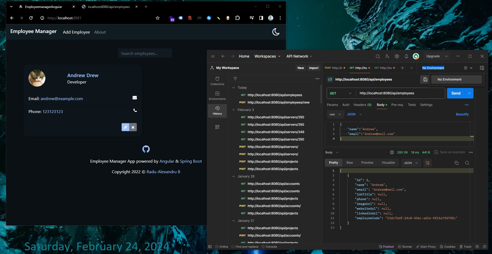
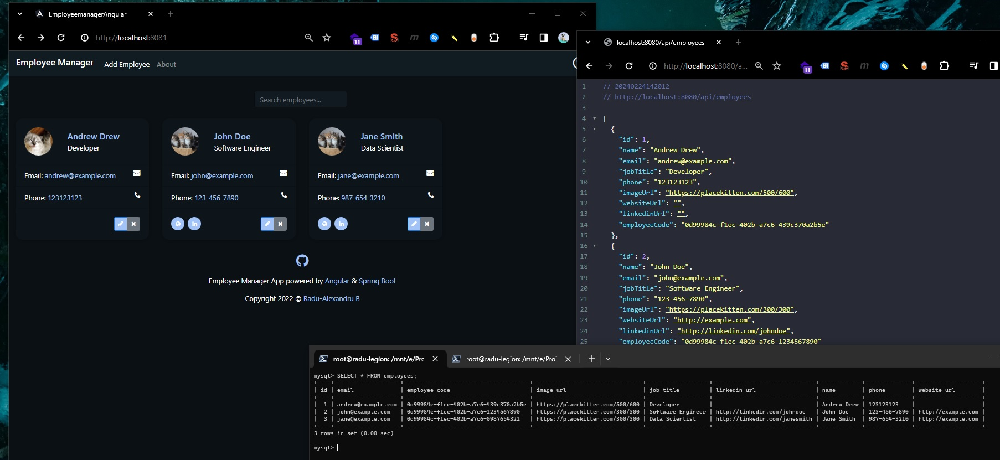

# Migrating from docker compose to podman compose

Table of Content (ToC):

- [Migrating from docker compose to podman compose](#migrating-from-docker-compose-to-podman-compose)
- [Podman in WSL Ubuntu 22.04 - Debian](#podman-in-wsl-ubuntu-2204---debian)
  - [Downloading Podman for WSL running Ubuntu 22.04](#downloading-podman-for-wsl-running-ubuntu-2204)
  - [Installing podman-compose on WSL Ubuntu](#installing-podman-compose-on-wsl-ubuntu)
  - [Running or Migrating current docker-compose.yml to podman-compose](#running-or-migrating-current-docker-composeyml-to-podman-compose)
    - [Small refactoring in docker-compose.yml](#small-refactoring-in-docker-composeyml)
    - [Creating network before running podman-compose up](#creating-network-before-running-podman-compose-up)
    - [Adding unqualified-search-registries to registries.conf](#adding-unqualified-search-registries-to-registriesconf)
    - [npm ERR! EMFILE: too many open files](#npm-err-emfile-too-many-open-files)
    - [Solving nf_tables errors](#solving-nf_tables-errors)
    - [Finally podman-compose up works](#finally-podman-compose-up-works)

<br/>

All resources used / used for troubleshooting / or not used:

- https://github.com/containers/podman-compose
- https://github.com/containers/dnsname/blob/main/README_PODMAN.md
- https://dale-bingham-soteriasoftware.medium.com/how-i-got-my-docker-compose-yml-to-work-switching-to-podman-compose-5252856c6eea
- https://docs.podman.io/en/stable/markdown/podman-network-reload.1.html
- https://docs.podman.io/en/latest/markdown/podman-pod-rm.1.html
- https://stackoverflow.com/questions/63287522/how-to-force-delete-all-podman-images-and-children
- https://github.com/containers/podman/issues/7889 Failed to remove image, image is in use by container #7889
- https://unix.stackexchange.com/questions/701784/podman-no-longer-searches-dockerhub-error-short-name-did-not-resolve-to-an
- https://mschirbel.medium.com/introduction-to-podman-from-scratch-to-hello-world-b26b126d18d4
- https://github.com/containers/podman/issues/12651 error loading cached network config: network "podman" not found in CNI cache
- https://github.com/containers/podman/issues/16106 The limit of open files in mounted volumes is 64, which is incredibly low
- https://docs.oracle.com/en/learn/podman-compose/index.html#confirm-podman-compose-is-working

<br/>

# Podman in WSL Ubuntu 22.04 - Debian

```bash
lsb_release -a
# No LSB modules are available.
# Distributor ID: Ubuntu
# Description:    Ubuntu 22.04.4 LTS
# Release:        22.04
# Codename:       jammy
```

<br/>

## Downloading Podman for WSL running Ubuntu 22.04

Note that currently our Ubuntu WSL does not contain docker.

From https://podman.io/docs/installation#linux-distributions

We can run

```bash
sudo apt update
sudo apt upgrade
sudo apt -y install podman
```

After installing podman, we can check if `podman` was installed by running

```bash
podman --version
# podman version 3.4.4
```

we can find more information on installed podman (such as installed podman plugins) by running:

```bash
podman info

# host:
#   arch: amd64
#   buildahVersion: 1.23.1
# ...
#   cpus: 16
#   distribution:
#     codename: jammy
#     distribution: ubuntu
#     version: "22.04"
# ...
#   kernel: 5.10.102.1-microsoft-standard-WSL2
# ...
#   os: linux
#   remoteSocket:
#     path: /run/podman/podman.sock
# ...
# plugins:
#   log:
#   - k8s-file
#   - none
#   - journald
#   network:
#   - bridge
#   - macvlan
#   volume:
#   - local
# registries:
#   search:
#   - docker.io
# ...
# store:
#   configFile: /etc/containers/storage.conf
#   containerStore:
#     number: 3
#     paused: 0
#     running: 3
#     stopped: 0
#   graphDriverName: overlay
#   graphOptions: {}
#   graphRoot: /var/lib/containers/storage
#   graphStatus:
#     Backing Filesystem: extfs
#     Native Overlay Diff: "true"
#     Supports d_type: "true"
#     Using metacopy: "false"
#   imageStore:
#     number: 29
#   runRoot: /run/containers/storage
#   volumePath: /var/lib/containers/storage/volumes
# version:
#   APIVersion: 3.4.4
#   Built: 0
#   BuiltTime: Thu Jan  1 02:00:00 1970
#   GitCommit: ""
#   GoVersion: go1.18.1
#   OsArch: linux/amd64
#   Version: 3.4.4
```

<br/>

## Installing podman-compose on WSL Ubuntu

https://github.com/containers/podman-compose

First requirement is to have installed "podman dnsname plugin" - https://github.com/containers/dnsname/blob/main/README_PODMAN.md

On Ubuntu, we can install it via:

```bash
sudo apt install dnsmasq

dnsmasq -v
# Dnsmasq version 2.86  Copyright (c) 2000-2021 Simon Kelley
# Compile time options: IPv6 GNU-getopt DBus no-UBus i18n IDN2 DHCP DHCPv6 no-Lua TFTP conntrack ipset auth cryptohash DNSSEC loop-detect inotify dumpfile

# This software comes with ABSOLUTELY NO WARRANTY.
# Dnsmasq is free software, and you are welcome to redistribute it
# under the terms of the GNU General Public License, version 2 or 3.
```

<br/>

From https://github.com/containers/podman-compose, we will need `python3` and `pip3` (package manager) in order to complete the installation of `podman-compose`:

```bash
python3 --version
# Python 3.10.12
```

```bash
sudo apt install python3-pip

pip3 -V
# pip 22.0.2 from /usr/lib/python3/dist-packages/pip (python 3.10)
```

Now we can run:

```bash
pip3 install podman-compose

# Collecting podman-compose
#   Downloading podman_compose-1.0.6-py2.py3-none-any.whl (34 kB)
# Requirement already satisfied: pyyaml in /usr/lib/python3/dist-packages (from podman-compose) (5.4.1)
# Collecting python-dotenv
#   Downloading python_dotenv-1.0.1-py3-none-any.whl (19 kB)
# Installing collected packages: python-dotenv, podman-compose
# Successfully installed podman-compose-1.0.6 python-dotenv-1.0.1
# WARNING: Running pip as the 'root' user can result in broken permissions and conflicting behaviour with the system package manager. It is recommended to use a virtual environment instead: https://pip.pypa.io/warnings/venv
```

Note that this will also install python3-dotenv (`sudo apt install python3-dotenv`) - this dependency is needed to run `docker-compose.yml` files.

<br/>

We can check `podman-compose` version:

```bash
podman-compose -v
# podman-compose version: 1.0.6
# ['podman', '--version', '']
# using podman version: 3.4.4
# podman-compose version 1.0.6
# podman --version
# podman version 3.4.4
```

<br/>

## Running or Migrating current docker-compose.yml to podman-compose

(Thursday, February 22, 2024, 20:00)

### Small refactoring in docker-compose.yml

https://dale-bingham-soteriasoftware.medium.com/how-i-got-my-docker-compose-yml-to-work-switching-to-podman-compose-5252856c6eea

🟡Note 01: All ports in the `docker-compose.yml` file needs to be on quotes.

🟡Note 02: In `docker-compose.yml` file, every image that is pulled directly from Docker Hub, needs it's "image" link to include "docker.io/" before. Example:

```yml
# docker-compose.yml
# From
  mysql-db:
    image: mysql:8.0
    ports:
      - "3306:3306"

# To
  mysql-db:
    image: docker.io/mysql:8.0
    ports:
      - "3306:3306"
```

<br/>

Now, in our project folder that contains the `docker-compose.yml` file, we can run `podman-compose up`

However, we will see the following errors:

```docker
WARN[0000] Error validating CNI config file /etc/cni/net.d/employeemanager_backend.conflist: [plugin bridge does not support config version "1.0.0" plugin portmap does not support config version "1.0.0" plugin firewall does not support config version "1.0.0" plugin tuning does not support config version "1.0.0"]
podman create --name=employeemanager_mysql-db_1 --label io.podman.compose.config-hash=80158f337b73d804dba143f3784ed0349774b021af9b43a69098d56c73d1df58 --label io.podman.compose.project=employeemanager --label io.podman.compose.version=1.0.6 --label PODMAN_SYSTEMD_UNIT=podman-compose@employeemanager.service --label com.docker.compose.project=employeemanager --label com.docker.compose.project.working_dir=/mnt/e/Proiecte SSD/SpringBoot/employeemanager --label com.docker.compose.project.config_files=docker-compose.yml --label com.docker.compose.container-number=1 --label com.docker.compose.service=mysql-db -e MYSQL_DATABASE=employeemanager -e MYSQL_USER=radu -e MYSQL_PASSWORD=radu123456 -e MYSQL_ROOT_PASSWORD=root123456 -v employeemanager_mysql-db:/var/lib/mysql --net employeemanager_backend --network-alias mysql-db -p 3306:3306 --restart unless-stopped --healthcheck-command /bin/sh -c mysqladmin' 'ping' '-h' 'localhost --healthcheck-interval 30s --healthcheck-timeout 30s --healthcheck-retries 5 mysql:8.0
WARN[0000] Error validating CNI config file /etc/cni/net.d/employeemanager_backend.conflist: [plugin bridge does not support config version "1.0.0" plugin portmap does not support config version "1.0.0" plugin firewall does not support config version "1.0.0" plugin tuning does not support config version "1.0.0"]
Error: short-name "mysql:8.0" did not resolve to an alias and no unqualified-search registries are defined in "/etc/containers/registries.conf"
exit code: 125
['podman', 'network', 'exists', 'employeemanager_backend']
WARN[0000] Error validating CNI config file /etc/cni/net.d/employeemanager_backend.conflist: [plugin bridge does not support config version "1.0.0" plugin portmap does not support config version "1.0.0" plugin firewall does not support config version "1.0.0" plugin tuning does not support config version "1.0.0"]
['podman', 'network', 'exists', 'employeemanager_frontend']
WARN[0000] Error validating CNI config file /etc/cni/net.d/employeemanager_backend.conflist: [plugin bridge does not support config version "1.0.0" plugin portmap does not support config version "1.0.0" plugin firewall does not support config version "1.0.0" plugin tuning does not support config version "1.0.0"]
['podman', 'network', 'create', '--label', 'io.podman.compose.project=employeemanager', '--label', 'com.docker.compose.project=employeemanager', 'employeemanager_frontend']
WARN[0000] Error validating CNI config file /etc/cni/net.d/employeemanager_backend.conflist: [plugin bridge does not support config version "1.0.0" plugin portmap does not support config version "1.0.0" plugin firewall does not support config version "1.0.0" plugin tuning does not support config version "1.0.0"]
['podman', 'network', 'exists', 'employeemanager_frontend']
WARN[0000] Error validating CNI config file /etc/cni/net.d/employeemanager_backend.conflist: [plugin bridge does not support config version "1.0.0" plugin portmap does not support config version "1.0.0" plugin firewall does not support config version "1.0.0" plugin tuning does not support config version "1.0.0"]
WARN[0000] Error validating CNI config file /etc/cni/net.d/employeemanager_frontend.conflist: [plugin bridge does not support config version "1.0.0" plugin portmap does not support config version "1.0.0" plugin firewall does not support config version "1.0.0" plugin tuning does not support config version "1.0.0"]
podman create --name=employeemanager_spring-api_1 --requires=employeemanager_mysql-db_1 --label io.podman.compose.config-hash=80158f337b73d804dba143f3784ed0349774b021af9b43a69098d56c73d1df58 --label io.podman.compose.project=employeemanager --label io.podman.compose.version=1.0.6 --label PODMAN_SYSTEMD_UNIT=podman-compose@employeemanager.service --label com.docker.compose.project=employeemanager --label com.docker.compose.project.working_dir=/mnt/e/Proiecte SSD/SpringBoot/employeemanager --label com.docker.compose.project.config_files=docker-compose.yml --label com.docker.compose.container-number=1 --label com.docker.compose.service=spring-api -e SPRING_DATASOURCE_URL=jdbc:mysql://mysql-db:3306/employeemanager?autoReconnect=true&useSSL=false&allowPublicKeyRetrieval=true -e SPRING_DATASOURCE_USERNAME=radu -e SPRING_DATASOURCE_PASSWORD=radu123456 -e APPLICATION_START_DELAY_IN_SECONDS=40 -e JAVA_TOOL_OPTIONS=-agentlib:jdwp=transport=dt_socket,server=y,suspend=n,address=*:5005 --net employeemanager_backend,employeemanager_frontend --network-alias spring-api -p 8080:8080 -p 5005:5005 --restart on-failure employeemanager_spring-api
WARN[0000] Error validating CNI config file /etc/cni/net.d/employeemanager_backend.conflist: [plugin bridge does not support config version "1.0.0" plugin portmap does not support config version "1.0.0" plugin firewall does not support config version "1.0.0" plugin tuning does not support config version "1.0.0"]
WARN[0000] Error validating CNI config file /etc/cni/net.d/employeemanager_frontend.conflist: [plugin bridge does not support config version "1.0.0" plugin portmap does not support config version "1.0.0" plugin firewall does not support config version "1.0.0" plugin tuning does not support config version "1.0.0"]
Error: short-name "employeemanager_spring-api" did not resolve to an alias and no unqualified-search registries are defined in "/etc/containers/registries.conf"
exit code: 125
['podman', 'network', 'exists', 'employeemanager_frontend']
WARN[0000] Error validating CNI config file /etc/cni/net.d/employeemanager_backend.conflist: [plugin bridge does not support config version "1.0.0" plugin portmap does not support config version "1.0.0" plugin firewall does not support config version "1.0.0" plugin tuning does not support config version "1.0.0"]
WARN[0000] Error validating CNI config file /etc/cni/net.d/employeemanager_frontend.conflist: [plugin bridge does not support config version "1.0.0" plugin portmap does not support config version "1.0.0" plugin firewall does not support config version "1.0.0" plugin tuning does not support config version "1.0.0"]
podman create --name=employeemanager_angular-client_1 --requires=employeemanager_spring-api_1,employeemanager_mysql-db_1 --label io.podman.compose.config-hash=80158f337b73d804dba143f3784ed0349774b021af9b43a69098d56c73d1df58 --label io.podman.compose.project=employeemanager --label io.podman.compose.version=1.0.6 --label PODMAN_SYSTEMD_UNIT=podman-compose@employeemanager.service --label com.docker.compose.project=employeemanager --label com.docker.compose.project.working_dir=/mnt/e/Proiecte SSD/SpringBoot/employeemanager --label com.docker.compose.project.config_files=docker-compose.yml --label com.docker.compose.container-number=1 --label com.docker.compose.service=angular-client --net employeemanager_frontend --network-alias angular-client -p 8081:80 --restart unless-stopped employeemanager_angular-client
WARN[0000] Error validating CNI config file /etc/cni/net.d/employeemanager_backend.conflist: [plugin bridge does not support config version "1.0.0" plugin portmap does not support config version "1.0.0" plugin firewall does not support config version "1.0.0" plugin tuning does not support config version "1.0.0"]
WARN[0000] Error validating CNI config file /etc/cni/net.d/employeemanager_frontend.conflist: [plugin bridge does not support config version "1.0.0" plugin portmap does not support config version "1.0.0" plugin firewall does not support config version "1.0.0" plugin tuning does not support config version "1.0.0"]
Error: short-name "employeemanager_angular-client" did not resolve to an alias and no unqualified-search registries are defined in "/etc/containers/registries.conf"
exit code: 125
podman start -a employeemanager_mysql-db_1
WARN[0000] Error validating CNI config file /etc/cni/net.d/employeemanager_backend.conflist: [plugin bridge does not support config version "1.0.0" plugin portmap does not support config version "1.0.0" plugin firewall does not support config version "1.0.0" plugin tuning does not support config version "1.0.0"]
WARN[0000] Error validating CNI config file /etc/cni/net.d/employeemanager_frontend.conflist: [plugin bridge does not support config version "1.0.0" plugin portmap does not support config version "1.0.0" plugin firewall does not support config version "1.0.0" plugin tuning does not support config version "1.0.0"]
Error: no container with name or ID "employeemanager_mysql-db_1" found: no such container
exit code: 125
podman start -a employeemanager_spring-api_1
WARN[0000] Error validating CNI config file /etc/cni/net.d/employeemanager_backend.conflist: [plugin bridge does not support config version "1.0.0" plugin portmap does not support config version "1.0.0" plugin firewall does not support config version "1.0.0" plugin tuning does not support config version "1.0.0"]
WARN[0000] Error validating CNI config file /etc/cni/net.d/employeemanager_frontend.conflist: [plugin bridge does not support config version "1.0.0" plugin portmap does not support config version "1.0.0" plugin firewall does not support config version "1.0.0" plugin tuning does not support config version "1.0.0"]
Error: no container with name or ID "employeemanager_spring-api_1" found: no such container
exit code: 125
podman start -a employeemanager_angular-client_1
WARN[0000] Error validating CNI config file /etc/cni/net.d/employeemanager_backend.conflist: [plugin bridge does not support config version "1.0.0" plugin portmap does not support config version "1.0.0" plugin firewall does not support config version "1.0.0" plugin tuning does not support config version "1.0.0"]
WARN[0000] Error validating CNI config file /etc/cni/net.d/employeemanager_frontend.conflist: [plugin bridge does not support config version "1.0.0" plugin portmap does not support config version "1.0.0" plugin firewall does not support config version "1.0.0" plugin tuning does not support config version "1.0.0"]
Error: no container with name or ID "employeemanager_angular-client_1" found: no such container
exit code: 125
```

<br/>

### Creating network before running podman-compose up

From [Jim's Garage podman-compose 10m](https://youtu.be/Gft9e1o3Hgg?t=609) video, we need to run:

```bash
podman network create proxy
# /etc/cni/net.d/proxy.conflist
```

Also from [Jim's Garage podman-compose 11m](https://youtu.be/Gft9e1o3Hgg?t=665) video, we need to change the version of the "cni" which controls the networks for the containers

```bash
nano /etc/cni/net.d/proxy.conflist
```

We need to change the "cniVersion" from "1.0.0" to "0.4.0"

```json
// cat /etc/cni/net.d/proxy.conflist
{
  "cniVersion": "0.4.0",
  "name": "proxy",
  "plugins": [
    {
      "type": "bridge",
      "bridge": "cni-podman3",
      "isGateway": true,
      "ipMasq": true,
      "hairpinMode": true,
      "ipam": {
        "type": "host-local",
        "routes": [
          {
            "dst": "0.0.0.0/0"
          }
        ],
        "ranges": [
          [
            {
              "subnet": "10.89.2.0/24",
              "gateway": "10.89.2.1"
            }
          ]
        ]
      }
    },
    {
      "type": "portmap",
      "capabilities": {
        "portMappings": true
      }
    },
    {
      "type": "firewall",
      "backend": ""
    },
    {
      "type": "tuning"
    },
    {
      "type": "dnsname",
      "domainName": "dns.podman",
      "capabilities": {
        "aliases": true
      }
    }
  ]
}
```

From https://docs.podman.io/en/stable/markdown/podman-network-reload.1.html - for this change to take effect, we can run:

```bash
podman network reload --all
```

<br/>

Now we can try to run again:

```bash
podman-compose up
```

Aaand we will still have warning and errors:

```log
Error: error creating build container: short-name "openjdk:11-jdk-slim" did not resolve to an alias and no unqualified-search registries are defined in "/etc/containers/registries.conf"
exit code: 125
['podman', 'inspect', '-t', 'image', '-f', '{{.Id}}', 'employeemanager_angular-client']
WARN[0000] Error validating CNI config file /etc/cni/net.d/employeemanager_backend.conflist: [plugin bridge does not support config version "1.0.0" plugin portmap does not support config version "1.0.0" plugin firewall does not support config version "1.0.0" plugin tuning does not support config version "1.0.0"]
WARN[0000] Error validating CNI config file /etc/cni/net.d/employeemanager_frontend.conflist: [plugin bridge does not support config version "1.0.0" plugin portmap does not support config version "1.0.0" plugin firewall does not support config version "1.0.0" plugin tuning does not support config version "1.0.0"]
Error: error inspecting object: employeemanager_angular-client: image not known
podman build -f ./employeemanager-angular/Angular.Dockerfile -t employeemanager_angular-client --build-arg API_BASE_URL=http://127.0.0.1:8080/ ./employeemanager-angular
WARN[0000] Error validating CNI config file /etc/cni/net.d/employeemanager_backend.conflist: [plugin bridge does not support config version "1.0.0" plugin portmap does not support config version "1.0.0" plugin firewall does not support config version "1.0.0" plugin tuning does not support config version "1.0.0"]
WARN[0000] Error validating CNI config file /etc/cni/net.d/employeemanager_frontend.conflist: [plugin bridge does not support config version "1.0.0" plugin portmap does not support config version "1.0.0" plugin firewall does not support config version "1.0.0" plugin tuning does not support config version "1.0.0"]

...

ERRO[0000] error loading cached network config: network "employeemanager_backend" not found in CNI cache
WARN[0000] falling back to loading from existing plugins on disk
WARN[0000] Error validating CNI config file /etc/cni/net.d/employeemanager_backend.conflist: [plugin bridge does not support config version "1.0.0" plugin portmap does not support config version "1.0.0" plugin firewall does not support config version "1.0.0" plugin tuning does not support config version "1.0.0"]
WARN[0000] Error validating CNI config file /etc/cni/net.d/employeemanager_frontend.conflist: [plugin bridge does not support config version "1.0.0" plugin portmap does not support config version "1.0.0" plugin firewall does not support config version "1.0.0" plugin tuning does not support config version "1.0.0"]
ERRO[0000] Error tearing down partially created network namespace for container d8b93c151f596cfff8ebc089df8024a36c2a2cddce4158d484281dd4446a1c2a: CNI network "employeemanager_backend" not found
ERRO[0000] Error removing timer for container d8b93c151f596cfff8ebc089df8024a36c2a2cddce4158d484281dd4446a1c2a healthcheck: unable to get systemd connection to remove healthchecks: dial unix /run/systemd/private: connect: no such file or directory
Error: unable to start container d8b93c151f596cfff8ebc089df8024a36c2a2cddce4158d484281dd4446a1c2a: error configuring network namespace for container d8b93c151f596cfff8ebc089df8024a36c2a2cddce4158d484281dd4446a1c2a: CNI network "employeemanager_backend" not found
exit code: 125
```

It seems that we need to change the cniVersion for every container:

```bash
ll /etc/cni/net.d/
# total 24
# drwxr-xr-x 2 root root 4096 Feb 22 20:57 ./
# drwxr-xr-x 3 root root 4096 Feb 22 20:10 ../
# -rw-r--r-- 1 root root  639 Dec 26  2021 87-podman-bridge.conflist
# -rw-r--r-- 1 root root    0 Feb 22 20:41 cni.lock
# -rw-r--r-- 1 root root 1167 Feb 22 20:41 employeemanager_backend.conflist
# -rw-r--r-- 1 root root 1168 Feb 22 20:41 employeemanager_frontend.conflist
# -rw-r--r-- 1 root root  984 Feb 22 20:57 proxy.conflist
```

```bash
nano /etc/cni/net.d/87-podman-bridge.conflist
nano /etc/cni/net.d/employeemanager_backend.conflist
nano /etc/cni/net.d/employeemanager_frontend.conflist

# Change cniVersion to 0.4.0
# Then run again
podman network reload --all
```

<br/>

Now let's try again running `podman-compose up` ... aaand still no luck:

```bash
podman-compose up
podman-compose version: 1.0.6
['podman', '--version', '']
using podman version: 3.4.4
** excluding:  set()
['podman', 'inspect', '-t', 'image', '-f', '{{.Id}}', 'employeemanager_spring-api']
Error: error inspecting object: employeemanager_spring-api: image not known
podman build -f ./Spring.Dockerfile -t employeemanager_spring-api .
[1/2] STEP 1/9: FROM openjdk:11-jdk-slim AS build
[2/2] STEP 1/7: FROM openjdk:11-jre-slim
Error: error creating build container: short-name "openjdk:11-jdk-slim" did not resolve to an alias and no unqualified-search registries are defined in "/etc/containers/registries.conf"
exit code: 125
['podman', 'inspect', '-t', 'image', '-f', '{{.Id}}', 'employeemanager_angular-client']
Error: error inspecting object: employeemanager_angular-client: image not known
podman build -f ./employeemanager-angular/Angular.Dockerfile -t employeemanager_angular-client --build-arg API_BASE_URL=http://127.0.0.1:8080/ ./employeemanager-angular
[1/2] STEP 1/7: FROM node:18 AS build
[1/2] STEP 2/7: WORKDIR /app
--> Using cache a780826367ac9a41bef08a9be2698cbf4df1e09f55fdad460dfa83a099f93692
--> a780826367a
[1/2] STEP 3/7: COPY package*.json ./
--> Using cache 348d6373ba3f525798350105d085a827c182701b85794a441a4ccfeba90646c1
--> 348d6373ba3
[1/2] STEP 4/7: RUN npm install
npm WARN deprecated source-map-resolve@0.6.0: See https://github.com/lydell/source-map-resolve#deprecated
npm WARN deprecated core-js@3.20.3: core-js@<3.23.3 is no longer maintained and not recommended for usage due to the number of issues. Because of the V8 engine whims, feature detection in old core-js versions could cause a slowdown up to 100x even if nothing is polyfilled. Some versions have web compatibility issues. Please, upgrade your dependencies to the actual version of core-js.
npm notice
npm notice New minor version of npm available! 10.2.4 -> 10.4.0
npm notice Changelog: <https://github.com/npm/cli/releases/tag/v10.4.0>
npm notice Run `npm install -g npm@10.4.0` to update!
npm notice
npm ERR! code EMFILE
npm ERR! syscall open
npm ERR! path /root/.npm/_cacache/index-v5/c3/db/483e6b07a338fc56daa546a5c7d73c769d72f488be87ff50117370bdf004
npm ERR! errno -24
npm ERR! EMFILE: too many open files, open '/root/.npm/_cacache/index-v5/c3/db/483e6b07a338fc56daa546a5c7d73c769d72f488be87ff50117370bdf004'

npm ERR! A complete log of this run can be found in: /root/.npm/_logs/2024-02-22T19_10_17_280Z-debug-0.log
[2/2] STEP 1/5: FROM nginx
Error: error building at STEP "RUN npm install": error while running runtime: exit status 232
exit code: 125
['podman', 'ps', '--filter', 'label=io.podman.compose.project=employeemanager', '-a', '--format', '{{ index .Labels "io.podman.compose.config-hash"}}']
podman volume inspect employeemanager_mysql-db || podman volume create employeemanager_mysql-db
['podman', 'volume', 'inspect', 'employeemanager_mysql-db']
['podman', 'network', 'exists', 'employeemanager_backend']
podman create --name=employeemanager_mysql-db_1 --label io.podman.compose.config-hash=13e5aa67937ec4ddc087c9375eaea0e25c2b68de2b5311a2798af12d52ca02f4 --label io.podman.compose.project=employeemanager --label io.podman.compose.version=1.0.6 --label PODMAN_SYSTEMD_UNIT=podman-compose@employeemanager.service --label com.docker.compose.project=employeemanager --label com.docker.compose.project.working_dir=/mnt/e/Proiecte SSD/SpringBoot/employeemanager --label com.docker.compose.project.config_files=docker-compose.yml --label com.docker.compose.container-number=1 --label com.docker.compose.service=mysql-db -e MYSQL_DATABASE=employeemanager -e MYSQL_USER=radu -e MYSQL_PASSWORD=radu123456 -e MYSQL_ROOT_PASSWORD=root123456 -v employeemanager_mysql-db:/var/lib/mysql --net employeemanager_backend --network-alias mysql-db -p 3306:3306 --restart unless-stopped --healthcheck-command /bin/sh -c mysqladmin' 'ping' '-h' 'localhost --healthcheck-interval 30s --healthcheck-timeout 30s --healthcheck-retries 5 docker.io/mysql:8.0
Error: error creating container storage: the container name "employeemanager_mysql-db_1" is already in use by "d8b93c151f596cfff8ebc089df8024a36c2a2cddce4158d484281dd4446a1c2a". You have to remove that container to be able to reuse that name.: that name is already in use
exit code: 125
['podman', 'network', 'exists', 'employeemanager_backend']
['podman', 'network', 'exists', 'employeemanager_frontend']
podman create --name=employeemanager_spring-api_1 --requires=employeemanager_mysql-db_1 --label io.podman.compose.config-hash=13e5aa67937ec4ddc087c9375eaea0e25c2b68de2b5311a2798af12d52ca02f4 --label io.podman.compose.project=employeemanager --label io.podman.compose.version=1.0.6 --label PODMAN_SYSTEMD_UNIT=podman-compose@employeemanager.service --label com.docker.compose.project=employeemanager --label com.docker.compose.project.working_dir=/mnt/e/Proiecte SSD/SpringBoot/employeemanager --label com.docker.compose.project.config_files=docker-compose.yml --label com.docker.compose.container-number=1 --label com.docker.compose.service=spring-api -e SPRING_DATASOURCE_URL=jdbc:mysql://mysql-db:3306/employeemanager?autoReconnect=true&useSSL=false&allowPublicKeyRetrieval=true -e SPRING_DATASOURCE_USERNAME=radu -e SPRING_DATASOURCE_PASSWORD=radu123456 -e APPLICATION_START_DELAY_IN_SECONDS=40 -e JAVA_TOOL_OPTIONS=-agentlib:jdwp=transport=dt_socket,server=y,suspend=n,address=*:5005 --net employeemanager_backend,employeemanager_frontend --network-alias spring-api -p 8080:8080 -p 5005:5005 --restart on-failure employeemanager_spring-api
Error: short-name "employeemanager_spring-api" did not resolve to an alias and no unqualified-search registries are defined in "/etc/containers/registries.conf"
exit code: 125
['podman', 'network', 'exists', 'employeemanager_frontend']
podman create --name=employeemanager_angular-client_1 --requires=employeemanager_mysql-db_1,employeemanager_spring-api_1 --label io.podman.compose.config-hash=13e5aa67937ec4ddc087c9375eaea0e25c2b68de2b5311a2798af12d52ca02f4 --label io.podman.compose.project=employeemanager --label io.podman.compose.version=1.0.6 --label PODMAN_SYSTEMD_UNIT=podman-compose@employeemanager.service --label com.docker.compose.project=employeemanager --label com.docker.compose.project.working_dir=/mnt/e/Proiecte SSD/SpringBoot/employeemanager --label com.docker.compose.project.config_files=docker-compose.yml --label com.docker.compose.container-number=1 --label com.docker.compose.service=angular-client --net employeemanager_frontend --network-alias angular-client -p 8081:80 --restart unless-stopped employeemanager_angular-client
Error: short-name "employeemanager_angular-client" did not resolve to an alias and no unqualified-search registries are defined in "/etc/containers/registries.conf"
exit code: 125
podman start -a employeemanager_mysql-db_1
ERRO[0000] error loading cached network config: network "employeemanager_backend" not found in CNI cache
WARN[0000] falling back to loading from existing plugins on disk
ERRO[0000] Error tearing down partially created network namespace for container d8b93c151f596cfff8ebc089df8024a36c2a2cddce4158d484281dd4446a1c2a: error removing pod employeemanager_mysql-db_1_employeemanager_mysql-db_1 from CNI network "employeemanager_backend": plugin type="bridge" failed (delete): running [/usr/sbin/iptables -t nat -D POSTROUTING -s 10.89.0.2 -j CNI-6f3da0cf616d53197b33d01f -m comment --comment name: "employeemanager_backend" id: "d8b93c151f596cfff8ebc089df8024a36c2a2cddce4158d484281dd4446a1c2a" --wait]: exit status 2: iptables v1.8.7 (nf_tables): Couldn't load match `comment':No such file or directory

Try `iptables -h' or 'iptables --help' for more information.
ERRO[0000] Error removing timer for container d8b93c151f596cfff8ebc089df8024a36c2a2cddce4158d484281dd4446a1c2a healthcheck: unable to get systemd connection to remove healthchecks: dial unix /run/systemd/private: connect: no such file or directory
Error: unable to start container d8b93c151f596cfff8ebc089df8024a36c2a2cddce4158d484281dd4446a1c2a: error configuring network namespace for container d8b93c151f596cfff8ebc089df8024a36c2a2cddce4158d484281dd4446a1c2a: error adding pod employeemanager_mysql-db_1_employeemanager_mysql-db_1 to CNI network "employeemanager_backend": plugin type="bridge" failed (add): running [/usr/sbin/iptables -t nat -C CNI-6f3da0cf616d53197b33d01f -d 10.89.0.2/24 -j ACCEPT -m comment --comment name: "employeemanager_backend" id: "d8b93c151f596cfff8ebc089df8024a36c2a2cddce4158d484281dd4446a1c2a" --wait]: exit status 2: iptables v1.8.7 (nf_tables): Couldn't load match `comment':No such file or directory

Try `iptables -h' or 'iptables --help' for more information.

exit code: 125
podman start -a employeemanager_spring-api_1
Error: no container with name or ID "employeemanager_spring-api_1" found: no such container
exit code: 125
podman start -a employeemanager_angular-client_1
Error: no container with name or ID "employeemanager_angular-client_1" found: no such container
exit code: 125
```

It seems that some containers are "already in use".

...

We might want to clear all the running containers and images by running

```bash
# List all pods?
podman pod ps

# Forcefully remove all pods
podman pod rm -f -a
```

From https://github.com/containers/podman/issues/7889 Failed to remove image, image is in use by container

```bash
# See default containers running by Buildah
podman ps --all --storage

CONTAINER ID  IMAGE                                                                                          COMMAND     CREATED         STATUS      PORTS       NAMES
b405204f1546  docker.io/library/node:18                                                                      buildah     17 minutes ago  storage                 node-working-container
54262dabf6c7  docker.io/library/5b41a6-tmp:latest  buildah     17 minutes ago  storage                 a780826367ac9a41bef08a9be2698cbf4df1e09f55fdad460dfa83a099f93692-working-container
b32e7d535bd8  docker.io/library/099688-tmp:latest  buildah     17 minutes ago  storage                 348d6373ba3f525798350105d085a827c182701b85794a441a4ccfeba90646c1-working-container

# clean up all the left over storage listed in podman ps --all --storage
buildah rm --all
```

From https://stackoverflow.com/questions/63287522/how-to-force-delete-all-podman-images-and-children

```bash
podman system prune --all --force && podman rmi --all
```

<br/>

And still no luck:

```bash
podman-compose up
podman-compose version: 1.0.6
['podman', '--version', '']
using podman version: 3.4.4
** excluding:  set()
['podman', 'inspect', '-t', 'image', '-f', '{{.Id}}', 'employeemanager_spring-api']
Error: error inspecting object: employeemanager_spring-api: image not known
podman build -f ./Spring.Dockerfile -t employeemanager_spring-api .
[1/2] STEP 1/9: FROM openjdk:11-jdk-slim AS build
[2/2] STEP 1/7: FROM openjdk:11-jre-slim
Error: error creating build container: short-name "openjdk:11-jdk-slim" did not resolve to an alias and no unqualified-search registries are defined in "/etc/containers/registries.conf"
exit code: 125
['podman', 'inspect', '-t', 'image', '-f', '{{.Id}}', 'employeemanager_angular-client']
Error: error inspecting object: employeemanager_angular-client: image not known
podman build -f ./employeemanager-angular/Angular.Dockerfile -t employeemanager_angular-client --build-arg API_BASE_URL=http://127.0.0.1:8080/ ./employeemanager-angular
[1/2] STEP 1/7: FROM node:18 AS build
Resolved "node" as an alias (/etc/containers/registries.conf.d/shortnames.conf)
Trying to pull docker.io/library/node:18...
Getting image source signatures
Copying blob 449619e06fe3 done
Copying blob 49b40be4436e done
Copying blob 2b9b41aaa3c5 done
Copying blob f52e55fee245 done
Copying blob c558fac597f8 done
Copying blob 7bb465c29149 done
Copying blob b51b5379e841 done
Copying blob 806ff1e3aade done
Copying config 39e9489311 done
Writing manifest to image destination
Storing signatures
[1/2] STEP 2/7: WORKDIR /app
--> 03c0b113311
[1/2] STEP 3/7: COPY package*.json ./
--> 7f2a10658b6
[1/2] STEP 4/7: RUN npm install
npm WARN deprecated source-map-resolve@0.6.0: See https://github.com/lydell/source-map-resolve#deprecated
npm WARN deprecated core-js@3.20.3: core-js@<3.23.3 is no longer maintained and not recommended for usage due to the number of issues. Because of the V8 engine whims, feature detection in old core-js versions could cause a slowdown up to 100x even if nothing is polyfilled. Some versions have web compatibility issues. Please, upgrade your dependencies to the actual version of core-js.
npm notice
npm notice New minor version of npm available! 10.2.4 -> 10.4.0
npm notice Changelog: <https://github.com/npm/cli/releases/tag/v10.4.0>
npm notice Run `npm install -g npm@10.4.0` to update!
npm notice
npm ERR! code EMFILE
npm ERR! syscall open
npm ERR! path /root/.npm/_cacache/index-v5/c3/db/483e6b07a338fc56daa546a5c7d73c769d72f488be87ff50117370bdf004
npm ERR! errno -24
npm ERR! EMFILE: too many open files, open '/root/.npm/_cacache/index-v5/c3/db/483e6b07a338fc56daa546a5c7d73c769d72f488be87ff50117370bdf004'

npm ERR! A complete log of this run can be found in: /root/.npm/_logs/2024-02-22T19_23_16_533Z-debug-0.log
[2/2] STEP 1/5: FROM nginx
Error: error building at STEP "RUN npm install": error while running runtime: exit status 232
exit code: 125
['podman', 'ps', '--filter', 'label=io.podman.compose.project=employeemanager', '-a', '--format', '{{ index .Labels "io.podman.compose.config-hash"}}']
podman volume inspect employeemanager_mysql-db || podman volume create employeemanager_mysql-db
['podman', 'volume', 'inspect', 'employeemanager_mysql-db']
Error: error inspecting object: no such volume employeemanager_mysql-db
['podman', 'volume', 'create', '--label', 'io.podman.compose.project=employeemanager', '--label', 'com.docker.compose.project=employeemanager', 'employeemanager_mysql-db']
['podman', 'volume', 'inspect', 'employeemanager_mysql-db']
['podman', 'network', 'exists', 'employeemanager_backend']
podman create --name=employeemanager_mysql-db_1 --label io.podman.compose.config-hash=13e5aa67937ec4ddc087c9375eaea0e25c2b68de2b5311a2798af12d52ca02f4 --label io.podman.compose.project=employeemanager --label io.podman.compose.version=1.0.6 --label PODMAN_SYSTEMD_UNIT=podman-compose@employeemanager.service --label com.docker.compose.project=employeemanager --label com.docker.compose.project.working_dir=/mnt/e/Proiecte SSD/SpringBoot/employeemanager --label com.docker.compose.project.config_files=docker-compose.yml --label com.docker.compose.container-number=1 --label com.docker.compose.service=mysql-db -e MYSQL_DATABASE=employeemanager -e MYSQL_USER=radu -e MYSQL_PASSWORD=radu123456 -e MYSQL_ROOT_PASSWORD=root123456 -v employeemanager_mysql-db:/var/lib/mysql --net employeemanager_backend --network-alias mysql-db -p 3306:3306 --restart unless-stopped --healthcheck-command /bin/sh -c mysqladmin' 'ping' '-h' 'localhost --healthcheck-interval 30s --healthcheck-timeout 30s --healthcheck-retries 5 docker.io/mysql:8.0
Trying to pull docker.io/library/mysql:8.0...
Getting image source signatures
Copying blob 81badc5f380f done
Copying blob 6a81d7aa4708 done
Copying blob 4b16e7be1767 done
Copying blob 3205e7b85ef5 done
Copying blob d8b021d6b4e1 done
Copying blob 8df9a740b0d6 done
Copying blob c88d6cb0b217 done
Copying blob 734b576d7682 done
Copying blob 20e828a3ad27 done
Copying blob a7d2a50df679 done
Copying blob fb468cb0f95b done
Copying config 7e6df44708 done
Writing manifest to image destination
Storing signatures
87d2960be9159f09b48f3dd70c8255991d2176fa4626be7a23b9b1aa4a219b9c
exit code: 0
['podman', 'network', 'exists', 'employeemanager_backend']
['podman', 'network', 'exists', 'employeemanager_frontend']
podman create --name=employeemanager_spring-api_1 --requires=employeemanager_mysql-db_1 --label io.podman.compose.config-hash=13e5aa67937ec4ddc087c9375eaea0e25c2b68de2b5311a2798af12d52ca02f4 --label io.podman.compose.project=employeemanager --label io.podman.compose.version=1.0.6 --label PODMAN_SYSTEMD_UNIT=podman-compose@employeemanager.service --label com.docker.compose.project=employeemanager --label com.docker.compose.project.working_dir=/mnt/e/Proiecte SSD/SpringBoot/employeemanager --label com.docker.compose.project.config_files=docker-compose.yml --label com.docker.compose.container-number=1 --label com.docker.compose.service=spring-api -e SPRING_DATASOURCE_URL=jdbc:mysql://mysql-db:3306/employeemanager?autoReconnect=true&useSSL=false&allowPublicKeyRetrieval=true -e SPRING_DATASOURCE_USERNAME=radu -e SPRING_DATASOURCE_PASSWORD=radu123456 -e APPLICATION_START_DELAY_IN_SECONDS=40 -e JAVA_TOOL_OPTIONS=-agentlib:jdwp=transport=dt_socket,server=y,suspend=n,address=*:5005 --net employeemanager_backend,employeemanager_frontend --network-alias spring-api -p 8080:8080 -p 5005:5005 --restart on-failure employeemanager_spring-api
Error: short-name "employeemanager_spring-api" did not resolve to an alias and no unqualified-search registries are defined in "/etc/containers/registries.conf"
exit code: 125
['podman', 'network', 'exists', 'employeemanager_frontend']
podman create --name=employeemanager_angular-client_1 --requires=employeemanager_spring-api_1,employeemanager_mysql-db_1 --label io.podman.compose.config-hash=13e5aa67937ec4ddc087c9375eaea0e25c2b68de2b5311a2798af12d52ca02f4 --label io.podman.compose.project=employeemanager --label io.podman.compose.version=1.0.6 --label PODMAN_SYSTEMD_UNIT=podman-compose@employeemanager.service --label com.docker.compose.project=employeemanager --label com.docker.compose.project.working_dir=/mnt/e/Proiecte SSD/SpringBoot/employeemanager --label com.docker.compose.project.config_files=docker-compose.yml --label com.docker.compose.container-number=1 --label com.docker.compose.service=angular-client --net employeemanager_frontend --network-alias angular-client -p 8081:80 --restart unless-stopped employeemanager_angular-client
Error: short-name "employeemanager_angular-client" did not resolve to an alias and no unqualified-search registries are defined in "/etc/containers/registries.conf"
exit code: 125
podman start -a employeemanager_mysql-db_1
ERRO[0000] error loading cached network config: network "employeemanager_backend" not found in CNI cache
WARN[0000] falling back to loading from existing plugins on disk
ERRO[0000] Error tearing down partially created network namespace for container 87d2960be9159f09b48f3dd70c8255991d2176fa4626be7a23b9b1aa4a219b9c: error removing pod employeemanager_mysql-db_1_employeemanager_mysql-db_1 from CNI network "employeemanager_backend": plugin type="bridge" failed (delete): running [/usr/sbin/iptables -t nat -D POSTROUTING -s 10.89.0.3 -j CNI-c839b50142f3f60150c57252 -m comment --comment name: "employeemanager_backend" id: "87d2960be9159f09b48f3dd70c8255991d2176fa4626be7a23b9b1aa4a219b9c" --wait]: exit status 2: iptables v1.8.7 (nf_tables): Couldn't load match `comment':No such file or directory

Try `iptables -h' or 'iptables --help' for more information.
podman start -a employeemanager_spring-api_1
ERRO[0001] Error removing timer for container 87d2960be9159f09b48f3dd70c8255991d2176fa4626be7a23b9b1aa4a219b9c healthcheck: unable to get systemd connection to remove healthchecks: dial unix /run/systemd/private: connect: no such file or directory
Error: unable to start container 87d2960be9159f09b48f3dd70c8255991d2176fa4626be7a23b9b1aa4a219b9c: error configuring network namespace for container 87d2960be9159f09b48f3dd70c8255991d2176fa4626be7a23b9b1aa4a219b9c: error adding pod employeemanager_mysql-db_1_employeemanager_mysql-db_1 to CNI network "employeemanager_backend": plugin type="bridge" failed (add): running [/usr/sbin/iptables -t nat -C CNI-c839b50142f3f60150c57252 -d 10.89.0.3/24 -j ACCEPT -m comment --comment name: "employeemanager_backend" id: "87d2960be9159f09b48f3dd70c8255991d2176fa4626be7a23b9b1aa4a219b9c" --wait]: exit status 2: iptables v1.8.7 (nf_tables): Couldn't load match `comment':No such file or directory

Try `iptables -h' or 'iptables --help' for more information.

exit code: 125
Error: no container with name or ID "employeemanager_spring-api_1" found: no such container
exit code: 125
podman start -a employeemanager_angular-client_1
Error: no container with name or ID "employeemanager_angular-client_1" found: no such container
exit code: 125
```

<br/>

### Adding unqualified-search-registries to registries.conf

Hmm, for the errors `Error: short-name "employeemanager_spring-api" did not resolve to an alias and no unqualified-search registries are defined in "/etc/containers/registries.conf"`, maybe we can add `unqualified-search-registries = ["docker.io"]` to `/etc/containers/registries.conf`? - Source https://unix.stackexchange.com/questions/701784/podman-no-longer-searches-dockerhub-error-short-name-did-not-resolve-to-an

```bash
nano /etc/containers/registries.conf

# Add or uncomment
unqualified-search-registries = ["docker.io"]
```

<br/>

Before retrying, let's run the followings:

```bash
podman pod ps
# nothing returned
podman container ps
# nothing returned

podman image ls
# REPOSITORY                            TAG          IMAGE ID      CREATED         SIZE
# localhost/employeemanager_spring-api  latest       0dad1b21ae33  7 minutes ago   266 MB
# <none>                                <none>       db53ef83aa6b  7 minutes ago   655 MB
# <none>                                <none>       7f2a10658b6a  22 minutes ago  1.12 GB
# docker.io/library/node                18           39e94893115b  6 days ago      1.12 GB
# docker.io/library/mysql               8.0          7e6df4470869  5 weeks ago     619 MB
# docker.io/library/openjdk             11-jre-slim  764a04af3eff  18 months ago   227 MB
# docker.io/library/openjdk             11-jdk-slim  8e687a82603f  18 months ago   428 MB

podman image prune -f
# podman image ls
# REPOSITORY                            TAG          IMAGE ID      CREATED        SIZE
# localhost/employeemanager_spring-api  latest       0dad1b21ae33  7 minutes ago  266 MB
# docker.io/library/node                18           39e94893115b  6 days ago     1.12 GB
# docker.io/library/mysql               8.0          7e6df4470869  5 weeks ago    619 MB
# docker.io/library/openjdk             11-jre-slim  764a04af3eff  18 months ago  227 MB
# docker.io/library/openjdk             11-jdk-slim  8e687a82603f  18 months ago  428 MB

podman ps --all --storage
# CONTAINER ID  IMAGE                                        COMMAND               CREATED         STATUS      PORTS                                           NAMES
# 87d2960be915  docker.io/library/mysql:8.0                  mysqld                23 minutes ago  Created     0.0.0.0:3306->3306/tcp                          employeemanager_mysql-db_1
# be3efefd4571  localhost/employeemanager_spring-api:latest  /bin/sh -c echo "...  8 minutes ago   Created     0.0.0.0:5005->5005/tcp, 0.0.0.0:8080->8080/tcp  employeemanager_spring-api_1

podman system prune --all --force && podman rmi --all

podman ps --all --storage
# nothing returned

podman system reset
# WARNING! This will remove:
#         - all containers
#         - all pods
#         - all images
#         - all build cache
# Are you sure you want to continue? [y/N] y
```

```bash
sudo podman-compose up
```

<br/>

Aaand we had some progress, but still unable to run the containers...:

```bash
[1/2] STEP 5/9: COPY pom.xml .
--> e534b07794d
[1/2] STEP 6/9: RUN ./mvnw dependency:go-offline -B
[INFO] Scanning for projects...
[INFO] Downloading from central: https://repo.maven.apache.org/maven2/org/springframework/boot/spring-boot-starter-parent/2.7.2/spring-boot-starter-parent-2.7.2.pom
...
...
...
[INFO] Resolved plugin: plexus-utils-3.0.15.jar
[INFO] Resolved plugin: commons-validator-1.3.1.jar
[INFO] Resolved plugin: plexus-utils-1.5.10.jar
[INFO] Resolved plugin: backport-util-concurrent-3.1.jar
[INFO] Resolved plugin: slf4j-jdk14-1.5.6.jar
[INFO] Resolved plugin: org.eclipse.sisu.plexus-0.0.0.M2a.jar
[INFO] Resolved dependency: slf4j-api-1.7.32.jar
[INFO] Resolved dependency: guava-31.0.1-jre.jar
[INFO] Resolved dependency: jakarta.inject-2.6.1.jar
[INFO] Resolved dependency: hk2-locator-2.6.1.jar
[INFO] Resolved dependency: hk2-utils-2.6.1.jar
...
...
...
[INFO] Resolved dependency: bcutil-jdk15on-1.70.jar
[INFO] ------------------------------------------------------------------------
[INFO] BUILD SUCCESS
[INFO] ------------------------------------------------------------------------
[INFO] Total time:  01:24 min
[INFO] Finished at: 2024-02-22T19:50:53Z
...
...
[INFO] -------------------< com.radubulai:employeemanager >--------------------
[INFO] Building employeemanager 0.0.1-SNAPSHOT
[INFO] --------------------------------[ jar ]---------------------------------
Downloading from central: https://repo.maven.apache.org/maven2/net/bytebuddy/byte-buddy/1.12.12/byte-buddy-1.12.12.pom
...
...
[INFO] --- spring-boot-maven-plugin:2.7.2:repackage (repackage) @ employeemanager ---
[INFO] Replacing main artifact with repackaged archive
[INFO] ------------------------------------------------------------------------
[INFO] BUILD SUCCESS
[INFO] ------------------------------------------------------------------------
[INFO] Total time:  5.071 s
[INFO] Finished at: 2024-02-22T19:51:01Z
[INFO] ------------------------------------------------------------------------
--> 4a14a8cfd03
[1/2] STEP 9/9: RUN mkdir -p target/dependency && (cd target/dependency; jar -xf ../*.jar)
--> 74443380e84
[2/2] STEP 1/7: FROM openjdk:11-jre-slim
...
...
...
...
...
...
...
exit code: 0
['podman', 'inspect', '-t', 'image', '-f', '{{.Id}}', 'employeemanager_angular-client']
Error: error inspecting object: employeemanager_angular-client: image not known
podman build -f ./employeemanager-angular/Angular.Dockerfile -t employeemanager_angular-client --build-arg API_BASE_URL=http://127.0.0.1:8080/ ./employeemanager-angular
[1/2] STEP 1/7: FROM node:18 AS build
Resolved "node" as an alias (/etc/containers/registries.conf.d/shortnames.conf)
Trying to pull docker.io/library/node:18...
Getting image source signatures
Copying blob 449619e06fe3 done
Copying blob c558fac597f8 done
Copying blob 49b40be4436e done
Copying blob 2b9b41aaa3c5 done
Copying blob f52e55fee245 done
Copying blob 7bb465c29149 done
Copying blob b51b5379e841 done
Copying blob 806ff1e3aade done
Copying config 39e9489311 done
Writing manifest to image destination
Storing signatures
[1/2] STEP 2/7: WORKDIR /app
--> fdbcc848219
[1/2] STEP 3/7: COPY package*.json ./
--> 2e055eb2711
[1/2] STEP 4/7: RUN npm install
npm WARN deprecated source-map-resolve@0.6.0: See https://github.com/lydell/source-map-resolve#deprecated
npm WARN deprecated core-js@3.20.3: core-js@<3.23.3 is no longer maintained and not recommended for usage due to the number of issues. Because of the V8 engine whims, feature detection in old core-js versions could cause a slowdown up to 100x even if nothing is polyfilled. Some versions have web compatibility issues. Please, upgrade your dependencies to the actual version of core-js.
npm notice
npm notice New minor version of npm available! 10.2.4 -> 10.4.0
npm notice Changelog: <https://github.com/npm/cli/releases/tag/v10.4.0>
npm notice Run `npm install -g npm@10.4.0` to update!
npm notice
npm ERR! code EMFILE
npm ERR! syscall open
npm ERR! path /root/.npm/_cacache/index-v5/c3/db/483e6b07a338fc56daa546a5c7d73c769d72f488be87ff50117370bdf004
npm ERR! errno -24
npm ERR! EMFILE: too many open files, open '/root/.npm/_cacache/index-v5/c3/db/483e6b07a338fc56daa546a5c7d73c769d72f488be87ff50117370bdf004'

npm ERR! A complete log of this run can be found in: /root/.npm/_logs/2024-02-22T19_51_24_494Z-debug-0.log
[2/2] STEP 1/5: FROM nginx
Resolving "nginx" using unqualified-search registries (/etc/containers/registries.conf)
Trying to pull docker.io/library/nginx:latest...
Error: error building at STEP "RUN npm install": error while running runtime: exit status 232
exit code: 125
['podman', 'ps', '--filter', 'label=io.podman.compose.project=employeemanager', '-a', '--format', '{{ index .Labels "io.podman.compose.config-hash"}}']
podman volume inspect employeemanager_mysql-db || podman volume create employeemanager_mysql-db
['podman', 'volume', 'inspect', 'employeemanager_mysql-db']
Error: error inspecting object: no such volume employeemanager_mysql-db
...
...
...
...
podman create --name=employeemanager_spring-api_1 --requires=employeemanager_mysql-db_1 --label io.podman.compose.config-hash=13e5aa67937ec4ddc087c9375eaea0e25c2b68de2b5311a2798af12d52ca02f4 --label io.podman.compose.project=employeemanager --label io.podman.compose.version=1.0.6 --label PODMAN_SYSTEMD_UNIT=podman-compose@employeemanager.service --label com.docker.compose.project=employeemanager --label com.docker.compose.project.working_dir=/mnt/e/Proiecte SSD/SpringBoot/employeemanager --label com.docker.compose.project.config_files=docker-compose.yml --label com.docker.compose.container-number=1 --label com.docker.compose.service=spring-api -e SPRING_DATASOURCE_URL=jdbc:mysql://mysql-db:3306/employeemanager?autoReconnect=true&useSSL=false&allowPublicKeyRetrieval=true -e SPRING_DATASOURCE_USERNAME=radu -e SPRING_DATASOURCE_PASSWORD=radu123456 -e APPLICATION_START_DELAY_IN_SECONDS=40 -e JAVA_TOOL_OPTIONS=-agentlib:jdwp=transport=dt_socket,server=y,suspend=n,address=*:5005 --net employeemanager_backend,employeemanager_frontend --network-alias spring-api -p 8080:8080 -p 5005:5005 --restart on-failure employeemanager_spring-api
1aee2bde7a7dbd5cc2d9d2f4320d1190ee98c8a56c4a9e011e3b591345d33586
exit code: 0
['podman', 'network', 'exists', 'employeemanager_frontend']
podman create --name=employeemanager_angular-client_1 --requires=employeemanager_spring-api_1,employeemanager_mysql-db_1 --label io.podman.compose.config-hash=13e5aa67937ec4ddc087c9375eaea0e25c2b68de2b5311a2798af12d52ca02f4 --label io.podman.compose.project=employeemanager --label io.podman.compose.version=1.0.6 --label PODMAN_SYSTEMD_UNIT=podman-compose@employeemanager.service --label com.docker.compose.project=employeemanager --label com.docker.compose.project.working_dir=/mnt/e/Proiecte SSD/SpringBoot/employeemanager --label com.docker.compose.project.config_files=docker-compose.yml --label com.docker.compose.container-number=1 --label com.docker.compose.service=angular-client --net employeemanager_frontend --network-alias angular-client -p 8081:80 --restart unless-stopped employeemanager_angular-client
Resolving "employeemanager_angular-client" using unqualified-search registries (/etc/containers/registries.conf)
Trying to pull docker.io/library/employeemanager_angular-client:latest...
Error: initializing source docker://employeemanager_angular-client:latest: reading manifest latest in docker.io/library/employeemanager_angular-client: errors:
denied: requested access to the resource is denied
unauthorized: authentication required

exit code: 125
podman start -a employeemanager_mysql-db_1
ERRO[0000] error loading cached network config: network "employeemanager_backend" not found in CNI cache
WARN[0000] falling back to loading from existing plugins on disk
ERRO[0000] Error tearing down partially created network namespace for container a40d723e7dd948d093501daeea0b2755e5d0f50cab8ce0012565b904dd899880: error removing pod employeemanager_mysql-db_1_employeemanager_mysql-db_1 from CNI network "employeemanager_backend": plugin type="bridge" failed (delete): running [/usr/sbin/iptables -t nat -D POSTROUTING -s 10.89.0.6 -j CNI-d24800471a6605d936e83f01 -m comment --comment name: "employeemanager_backend" id: "a40d723e7dd948d093501daeea0b2755e5d0f50cab8ce0012565b904dd899880" --wait]: exit status 2: iptables v1.8.7 (nf_tables): Couldn't load match `comment':No such file or directory

Try `iptables -h' or 'iptables --help' for more information.
ERRO[0000] Error removing timer for container a40d723e7dd948d093501daeea0b2755e5d0f50cab8ce0012565b904dd899880 healthcheck: unable to get systemd connection to remove healthchecks: dial unix /run/systemd/private: connect: no such file or directory
Error: unable to start container a40d723e7dd948d093501daeea0b2755e5d0f50cab8ce0012565b904dd899880: error configuring network namespace for container a40d723e7dd948d093501daeea0b2755e5d0f50cab8ce0012565b904dd899880: error adding pod employeemanager_mysql-db_1_employeemanager_mysql-db_1 to CNI network "employeemanager_backend": plugin type="bridge" failed (add): running [/usr/sbin/iptables -t nat -C CNI-d24800471a6605d936e83f01 -d 10.89.0.6/24 -j ACCEPT -m comment --comment name: "employeemanager_backend" id: "a40d723e7dd948d093501daeea0b2755e5d0f50cab8ce0012565b904dd899880" --wait]: exit status 2: iptables v1.8.7 (nf_tables): Couldn't load match `comment':No such file or directory

Try `iptables -h' or 'iptables --help' for more information.

exit code: 125
podman start -a employeemanager_spring-api_1
ERRO[0000] error loading cached network config: network "employeemanager_backend" not found in CNI cache
WARN[0000] falling back to loading from existing plugins on disk
ERRO[0000] Error tearing down partially created network namespace for container a40d723e7dd948d093501daeea0b2755e5d0f50cab8ce0012565b904dd899880: error removing pod employeemanager_mysql-db_1_employeemanager_mysql-db_1 from CNI network "employeemanager_backend": plugin type="bridge" failed (delete): running [/usr/sbin/iptables -t nat -D POSTROUTING -s 10.89.0.7 -j CNI-d24800471a6605d936e83f01 -m comment --comment name: "employeemanager_backend" id: "a40d723e7dd948d093501daeea0b2755e5d0f50cab8ce0012565b904dd899880" --wait]: exit status 2: iptables v1.8.7 (nf_tables): Couldn't load match `comment':No such file or directory

Try `iptables -h' or 'iptables --help' for more information.
ERRO[0000] Error removing timer for container a40d723e7dd948d093501daeea0b2755e5d0f50cab8ce0012565b904dd899880 healthcheck: unable to get systemd connection to remove healthchecks: dial unix /run/systemd/private: connect: no such file or directory
ERRO[0000] error starting some container dependencies
ERRO[0000] "error configuring network namespace for container a40d723e7dd948d093501daeea0b2755e5d0f50cab8ce0012565b904dd899880: error adding pod employeemanager_mysql-db_1_employeemanager_mysql-db_1 to CNI network \"employeemanager_backend\": plugin type=\"bridge\" failed (add): running [/usr/sbin/iptables -t nat -C CNI-d24800471a6605d936e83f01 -d 10.89.0.7/24 -j ACCEPT -m comment --comment name: \"employeemanager_backend\" id: \"a40d723e7dd948d093501daeea0b2755e5d0f50cab8ce0012565b904dd899880\" --wait]: exit status 2: iptables v1.8.7 (nf_tables): Couldn't load match `comment':No such file or directory\n\nTry `iptables -h' or 'iptables --help' for more information.\n"
Error: unable to start container 1aee2bde7a7dbd5cc2d9d2f4320d1190ee98c8a56c4a9e011e3b591345d33586: error starting some containers: internal libpod error
exit code: 125
podman start -a employeemanager_angular-client_1
Error: no container with name or ID "employeemanager_angular-client_1" found: no such container
exit code: 125
```

<br/>
<br/>

### npm ERR! EMFILE: too many open files

Okay, for the error `npm ERR! EMFILE: too many open files`, it might be an issue with the host (our Ubuntu 22.04 running as WSL in Windows) - https://stackoverflow.com/questions/8965606/node-and-error-emfile-too-many-open-files

[From [Option 01](https://stackoverflow.com/questions/8965606/node-and-error-emfile-too-many-open-files)] If we ran

```bash
ulimit -a

real-time non-blocking time  (microseconds, -R) unlimited
core file size              (blocks, -c) 0
data seg size               (kbytes, -d) unlimited
scheduling priority                 (-e) 0
file size                   (blocks, -f) unlimited
pending signals                     (-i) 74753
max locked memory           (kbytes, -l) 64
max memory size             (kbytes, -m) unlimited
open files                          (-n) 1024
pipe size                (512 bytes, -p) 8
POSIX message queues         (bytes, -q) 819200
real-time priority                  (-r) 0
stack size                  (kbytes, -s) 8192
cpu time                   (seconds, -t) unlimited
max user processes                  (-u) 74753
virtual memory              (kbytes, -v) unlimited
file locks                          (-x) unlimited
```

We can change the `open files` limit by running:

```bash
ulimit -n 65535

# now if we check again
ulimit -a | grep "open files"
# open files                          (-n) 65535
```

<br/>

[From [Option 02](https://stackoverflow.com/questions/8965606/node-and-error-emfile-too-many-open-files)] Increase the available limit to e.g. 65535

```bash
sudo nano /etc/sysctl.conf

# Add the following line to it
fs.file-max = 65535
```

Run this to refresh with new config

```bash
sudo sysctl -p
```

Edit the following file

```bash
sudo vim /etc/security/limits.conf

# Add the following lines to it
root soft     nproc          65535
root hard     nproc          65535
root soft     nofile         65535
root hard     nofile         65535
```

Edit the following file

```bash
sudo vim /etc/pam.d/common-session

# Add this line to it
session required pam_limits.so
```

Logout and login and try the following command

```bash
user@ubuntu:~$ ulimit -n
65535

# or in WSL
exit()
wsl --shutdown
wsl
```

<br/>
<br/>

Note: After the above open files limit configuration, we might need to run again::

```bash
podman-compose down --remove-orphans
podman system prune --all --force && podman rmi --all
podman system reset
```

(Another resource https://github.com/containers/podman/issues/16106 - A workaround is `podman machine stop && ulimit -n unlimited && podman machine start`)

<br/>

### Solving nf_tables errors

🔴🔴🔴 Note: if we run `sudo podman run hello-world` we still receive `nf_tables` errors (it seems to be an Ubuntu/Debian issue):

```bash
sudo podman run hello-world
ERRO[0000] error loading cached network config: network "podman" not found in CNI cache
WARN[0000] falling back to loading from existing plugins on disk
ERRO[0000] Error tearing down partially created network namespace for container a378fedecd28d344ff3ed4a97b1d5cffd9ae0d08c665e943b2365b363385a028: error removing pod eager_napier_eager_napier from CNI network "podman": plugin type="bridge" failed (delete): running [/usr/sbin/iptables -t nat -D POSTROUTING -s 10.88.0.6 -j CNI-1f56c2f5c5e7264362b4a020 -m comment --comment name: "podman" id: "a378fedecd28d344ff3ed4a97b1d5cffd9ae0d08c665e943b2365b363385a028" --wait]: exit status 2: iptables v1.8.7 (nf_tables): Couldn't load match `comment':No such file or directory

Try `iptables -h' or 'iptables --help' for more information.
Error: error configuring network namespace for container a378fedecd28d344ff3ed4a97b1d5cffd9ae0d08c665e943b2365b363385a028: error adding pod eager_napier_eager_napier to CNI network "podman": plugin type="bridge" failed (add): running [/usr/sbin/iptables -t nat -C CNI-1f56c2f5c5e7264362b4a020 -d 10.88.0.6/16 -j ACCEPT -m comment --comment name: "podman" id: "a378fedecd28d344ff3ed4a97b1d5cffd9ae0d08c665e943b2365b363385a028" --wait]: exit status 2: iptables v1.8.7 (nf_tables): Couldn't load match `comment':No such file or directory

Try `iptables -h' or 'iptables --help' for more information.
```

Solution: https://github.com/microsoft/WSL/issues/7948:

> Based on my experience with Debian Sid, I suspect that:
>
> - running podman rootless (i.e. as non-root user) won't give you this issue
> - if you insist on running podman rootfull (i.e. as root user) you need to configure iptables-legacy to avoid this issue:
>
> ```bash
> update-alternatives --set iptables /usr/sbin/iptables-legacy
> update-alternatives --set ip6tables /usr/sbin/ip6tables-legacy
> ```

```bash
sudo podman run hello-world

# Hello from Docker!
# This message shows that your installation appears to be working correctly.

# To generate this message, Docker took the following steps:
#  1. The Docker client contacted the Docker daemon.
#  2. The Docker daemon pulled the "hello-world" image from the Docker Hub.
#     (amd64)
#  3. The Docker daemon created a new container from that image which runs the
#     executable that produces the output you are currently reading.
#  4. The Docker daemon streamed that output to the Docker client, which sent it
#     to your terminal.

# To try something more ambitious, you can run an Ubuntu container with:
#  $ docker run -it ubuntu bash

# Share images, automate workflows, and more with a free Docker ID:
#  https://hub.docker.com/

# For more examples and ideas, visit:
#  https://docs.docker.com/get-started/
```

<br/>

### Finally podman-compose up works

After all the above troubleshooting steps, we can successfully run `podman-compose up` after clearing again everything:

```bash
podman-compose down --remove-orphans
podman system prune --all --force && podman rmi --all
podman system reset

podman-compose up
```

And we will have our application up and running on ports:

- http://localhost:8080/api/employees - Backend Spring Boot API
- http://localhost:8081/ - Frontend Angular App
- http://localhost:3306/ - MySQL

<br/>

```bash
podman ps -a

CONTAINER ID  IMAGE                                            COMMAND               CREATED       STATUS                      PORTS                                           NAMES
ca9056bdc980  docker.io/library/mysql:8.0                      mysqld                39 hours ago  Up 39 hours ago (starting)  0.0.0.0:3306->3306/tcp                          employeemanager_mysql-db_1
0903d1ab3f9d  localhost/employeemanager_spring-api:latest      /bin/sh -c echo "...  39 hours ago  Up 39 hours ago             0.0.0.0:5005->5005/tcp, 0.0.0.0:8080->8080/tcp  employeemanager_spring-api_1
b14c2a934c5c  localhost/employeemanager_angular-client:latest
```



<br/>

Just for fun, we can try to enter the Podman MySQL container and insert some employees into the employees table:

Certainly! To enter the MySQL container and insert some employees into the `employees` table, you can follow these steps:

**Access the MySQL Container**:

```bash
podman exec -it employeemanager_mysql-db_1 bash
```

**Access MySQL Command Line**:
Once inside the MySQL container, ccess the MySQL command line by running:

```bash
mysql -u radu -p
```

Enter the password as `radu123456` (the one set in the `docker-compose.yml` file).

**Read and Insert Employees**:
After we logged into the MySQL command line, we can use SQL commands to insert employees into the `employees` table:

```sql
USE employeemanager;
-- Reading table information for completion of table and column names
-- You can turn off this feature to get a quicker startup with -A

-- Database changed
```

```sql
SELECT * FROM employees;
```

```
+----+--------------------+--------------------------------------+---------------------------------+-----------+--------------+-------------+-----------+-------------+
| id | email              | employee_code                        | image_url                       | job_title | linkedin_url | name        | phone     | website_url |
+----+--------------------+--------------------------------------+---------------------------------+-----------+--------------+-------------+-----------+-------------+
|  1 | andrew@example.com | 0d99984c-f1ec-402b-a7c6-439c370a2b5e | https://placekitten.com/500/600 | Developer |              | Andrew Drew | 123123123 |             |
+----+--------------------+--------------------------------------+---------------------------------+-----------+--------------+-------------+-----------+-------------+
```

```sql
INSERT INTO employees (name, email, job_title, phone, image_url, website_url, linkedin_url, employee_code)
VALUES
('John Doe', 'john@example.com', 'Software Engineer', '123-456-7890', 'https://placekitten.com/300/300', 'http://example.com', 'http://linkedin.com/johndoe', '0d99984c-f1ec-402b-a7c6-1234567890'),
('Jane Smith', 'jane@example.com', 'Data Scientist', '987-654-3210', 'https://placekitten.com/300/300', 'http://example.com', 'http://linkedin.com/janesmith', '0d99984c-f1ec-402b-a7c6-0987654321');

-- Query OK, 2 rows affected (0.01 sec)
-- Records: 2  Duplicates: 0  Warnings: 0
```

Adjust the values according to the structure and requirements of your `Employee` class.

**Verify**:
After executing the insert commands, you can verify if the data has been inserted successfully by querying the `employees` table:

```sql
SELECT * FROM employees;
```



(Saturday, February 24, 2024, 14:25)

<br/>

To get out from the MySQL command line, and also get out from Docker MySQL Container, just run "exit" twice:

```bash
mysql> exit
# Bye
bash-4.4 exit
# exit
# root@radu:/mnt/e/...
```

We can also run `podman-compose down` to stop the application (with `-v` flag to remove the volumes - in this case, all the data in the MySQL database)

```bash
podman-compose down -v --remove-orphans

podman ps -a
# should not return any containers for EmployeeManager application

podman images ls
# should not return any images for EmployeeManager application
```
